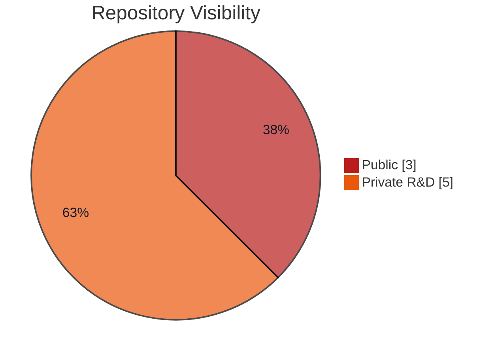
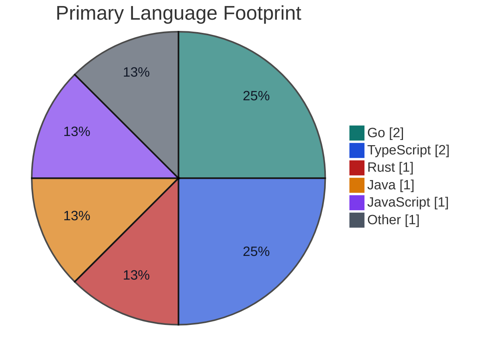

  

  
  
  

  
  
  
  
  
  

  <strong>redstone.md</strong> builds AI-native infrastructure, browser automation engines, reverse-engineering tooling, and distributed runtimes.
   
  Most work happens in private R&amp;D tracks while we extract stable public surfaces as standalone tools.

## What We Build

<table>
  <tr>
    <td width="50%" valign="top">
      <h3>Agent-Native Browsers</h3>
      
Browser engines and control surfaces designed for AI agents, automation flows, and protocol-level integrations.

    </td>
    <td width="50%" valign="top">
      <h3>Reverse Engineering Tooling</h3>
      
Code-intelligence pipelines for crawling, unpacking, mapping, and explaining modern frontend systems.

    </td>
  </tr>
  <tr>
    <td width="50%" valign="top">
      <h3>Mesh &amp; Embedded Networking</h3>
      
Distributed runtime components and peer-to-peer primitives aimed at resilient local-first systems.

    </td>
    <td width="50%" valign="top">
      <h3>Operator-Focused Apps</h3>
      
Desktop and local tooling that turn complex runtimes into workflows people can actually operate.

    </td>
  </tr>
</table>

## Public Projects

<table>
  <tr>
    <td width="50%" valign="top">
      <h3><a href="https://github.com/redstone-md/agentium">Agentium</a></h3>
      

        
        
        
      

      
AI-native browser engine in Go that drives Chromium through CDP, exposes a REST API for sessions, and ships MCP tools for agent workflows.

      
<strong>Focus:</strong> Chromium, CDP, MCP, browser orchestration, automation infrastructure.

    </td>
    <td width="50%" valign="top">
      <h3><a href="https://github.com/redstone-md/Mapr">Mapr</a></h3>
      

        
        
        
      

      
Bun-native CLI/TUI for deep frontend reverse engineering, artifact collection, multi-agent analysis, and Markdown report generation.

      
<strong>Focus:</strong> code intelligence, deobfuscation, call graphs, reverse engineering, AI-assisted analysis.

    </td>
  </tr>
</table>

## Private R&D Surface

We currently maintain additional private tracks around:

- distributed mesh runtimes
- operator desktop clients
- local AI gateways
- low-level systems experiments
- game-adjacent networking prototypes

That split is intentional: public repositories show the stable edge, while private repositories absorb rapid iteration.

## Organization Snapshot

These charts are based on the current repository layout of the organization as of March 19, 2026.

## Working Style

- We prefer protocol-aware tools over thin wrappers.
- We ship local-first systems with strong operator ergonomics.
- We use AI where it increases leverage, not where it adds noise.
- We release focused public components once the core surfaces are stable.

## Reach Out

- Website: [redstone.md](https://redstone.md)
- GitHub: [github.com/redstone-md](https://github.com/redstone-md)
- Contact: [carpet@redstone.md](mailto:carpet@redstone.md)
