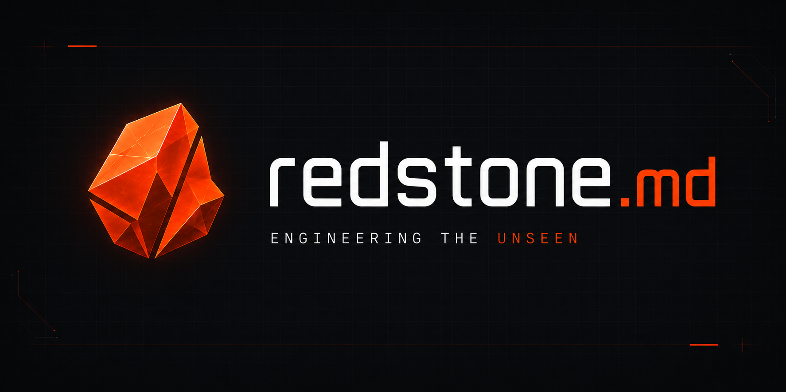
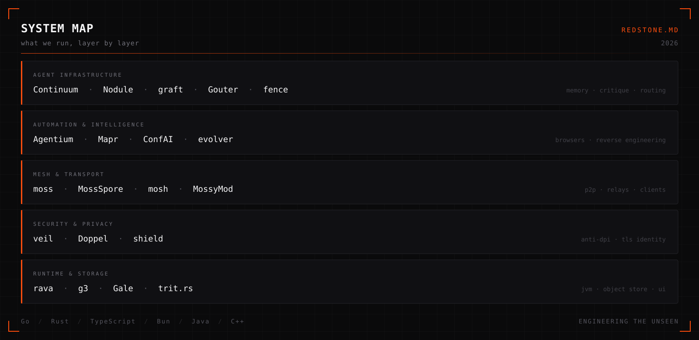

  

  
  
  

  <b>redstone.md</b> builds infrastructure for machines that act on their own — 
  agent runtimes, browser automation, peer-to-peer transport, and the privacy layer under all of it. 
  Most of it ships as a single binary. All of it runs local-first.

 

<picture>
  <source media="(prefers-color-scheme: dark)" srcset="./assets/map-dark.svg" />
  <source media="(prefers-color-scheme: light)" srcset="./assets/map-light.svg" />
  
</picture>

 

## Shipping now

<table border="0">
  <tr>
    <td width="50%" valign="top">
      <h3><a href="https://github.com/redstone-md/Continuum">Continuum</a></h3>
      

        
        
      

      
MCP server that gives Claude Code, Codex, Gemini CLI and OpenCode one shared view of a codebase — plus memory that outlives the session.

    </td>
    <td width="50%" valign="top">
      <h3><a href="https://github.com/redstone-md/Mapr">Mapr</a></h3>
      

        
        
      

      
Frontend reverse-engineering TUI. Crawls a target, feeds chunked bundles through a multi-agent pipeline, and writes back call graphs and restored names.

    </td>
  </tr>
  <tr>
    <td width="50%" valign="top">
      <h3><a href="https://github.com/redstone-md/moss">moss</a></h3>
      

        
        
      

      
P2P mesh core, embeddable anywhere. Written in Go, exported through CGO as a C shared library — so Rust, Java and C++ clients all speak the same protocol.

    </td>
    <td width="50%" valign="top">
      <h3><a href="https://github.com/redstone-md/g3">g3</a></h3>
      

        
        
      

      
S3-compatible object storage backed by a pool of Google Drive accounts. Balanced across the pool, one binary, web panel included.

    </td>
  </tr>
  <tr>
    <td width="50%" valign="top">
      <h3><a href="https://github.com/redstone-md/veil">veil</a></h3>
      

        
        
      

      
VPN platform for networks with live DPI — Russia, China, Iran. Built on one idea: make blocking it expensive enough to break the legitimate web.

    </td>
    <td width="50%" valign="top">
      <h3><a href="https://github.com/redstone-md/rava">rava</a></h3>
      

        
        
      

      
A Java runtime written in Rust. Aimed at running real Java workloads on machines with no system JVM.

    </td>
  </tr>
  <tr>
    <td width="50%" valign="top">
      <h3><a href="https://github.com/redstone-md/ConfAI">ConfAI</a></h3>
      

        
        
      

      
One editor for every coding agent's config — Codex, Claude Code, opencode. Switch providers and sync models without hand-mangling the file.

    </td>
    <td width="50%" valign="top">
      <h3><a href="https://github.com/redstone-md/agentium">Agentium</a></h3>
      

        
        
      

      
Browser engine for agents, not people. Drives Chromium over CDP and exposes sessions through both REST and MCP tools.

    </td>
  </tr>
</table>

## Also public

| Project | | |
| --- | --- | --- |
| [**Nodule**](https://github.com/redstone-md/Nodule) | Go | Local MCP server whose one tool, `bounce_idea`, sends your design to a second LLM for critique |
| [**graft**](https://github.com/redstone-md/graft) | Go | Runs a prompt across a panel of models in parallel, then has a judge synthesize the winner |
| [**Doppel**](https://github.com/redstone-md/Doppel) | Go | Transparent TLS identity proxy for automation and network-fingerprint research |
| [**shield**](https://github.com/redstone-md/shield) | Go | Self-hosted Telegram moderation and anti-spam bot |
| [**MossSpore**](https://github.com/redstone-md/MossSpore) | Go | Headless relay daemon for the Moss mesh — launch one, become a point of presence |
| [**mosh**](https://github.com/redstone-md/mosh) | Rust | Desktop chat client for the MOSS runtime |
| [**MossyMod**](https://github.com/redstone-md/MossyMod) | Java | Fabric mod putting mesh world discovery and P2P joins into Minecraft |
| [**Gale**](https://github.com/redstone-md/Gale) | Go | Declarative Go UI toolkit — signals, flex layout, native rendering backends |
| [**Gouter**](https://github.com/redstone-md/Gouter) | Go | AI API gateway |
| [**fence**](https://github.com/redstone-md/fence) | Bun | Anthropic-compatible chat API over the claude.ai web backend |
| [**EmailHub**](https://github.com/redstone-md/EmailHub) | Bun | Temporary email hub for inbound fan-out |
| [**silktouch**](https://github.com/redstone-md/silktouch) | Python | Modular media downloader bot — yt-dlp, local Bot API, 2 GB uploads |
| [**DDC**](https://github.com/redstone-md/DDC) | Java | Tabletop RPG rules and storytelling grafted onto Minecraft — Fabric and NeoForge |

## Private stack

The lab keeps a faster-moving half: AGI baseline research, agent orchestration, e-commerce and email automation, inference routing. Nothing there is stable enough to depend on. Some of it graduates to the list above.

---

  Stable edge in public. Deeper stack in private.
   
  <b>redstone.md</b> · 2026

