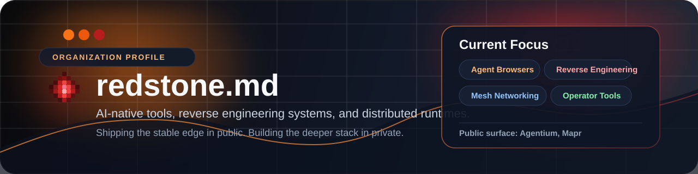

  

  

  
  
  

 

  <h3 style="color: #EA580C;">⚡ Engineering the Unseen</h3>
  
<strong>redstone.md</strong> is an R&D collective focused on AI-native infrastructure, browser automation, and distributed systems. We build the tools that empower agents and the runtimes that secure them.

 

## 🏗️ Core R&D Tracks

<table border="0">
  <tr>
    <td width="50%" valign="top">
      <h3>🌐 Agent-Native Browsers</h3>
      
Control surfaces designed for LLM-driven automation and protocol-level browser orchestration.

    </td>
    <td width="50%" valign="top">
      <h3>🔍 Reverse Engineering</h3>
      
Deep-intelligence pipelines for deobfuscation, mapping, and explaining modern frontend targets.

    </td>
  </tr>
  <tr>
    <td width="50%" valign="top">
      <h3>🕸️ Mesh Runtimes</h3>
      
Peer-to-peer primitives and distributed compute modules for resilient local-first environments.

    </td>
    <td width="50%" valign="top">
      <h3>🛠️ Operator Tooling</h3>
      
High-ergonomic desktop clients and CLIs that turn complex infrastructure into actionable workflows.

    </td>
  </tr>
</table>

## 🚀 Stable Public Surface

<table border="0">
  <tr>
    <td width="50%" valign="top">
      <h3><a href="https://github.com/redstone-md/agentium">Agentium</a></h3>
      

        
        
      

      
AI-native browser engine driving Chromium through CDP, exposing REST and MCP tools for agentic workflows.

    </td>
    <td width="50%" valign="top">
      <h3><a href="https://github.com/redstone-md/Mapr">Mapr</a></h3>
      

        
        
      

      
Bun-native reverse engineering CLI for deep artifact collection and AI-assisted code intelligence.

    </td>
  </tr>
</table>

## 🛡️ The Deep Stack (Private)

Our internal lab maintains rapid-iteration repositories for:
- **Distributed Mesh Runtimes**: Local-first compute primitives.
- **Local AI Gateways**: Secure routing and evaluation for agent workloads.
- **Experimental Systems**: Low-level networking and protocol-heavy prototypes.

## 🛠️ Stack & Ecosystem

  

 

  
  
  

---

  <em style="color: #94A3B8;">Shipping the stable edge in public. Building the deeper stack in private.</em>
   
  <strong>redstone.md • 2026</strong>

